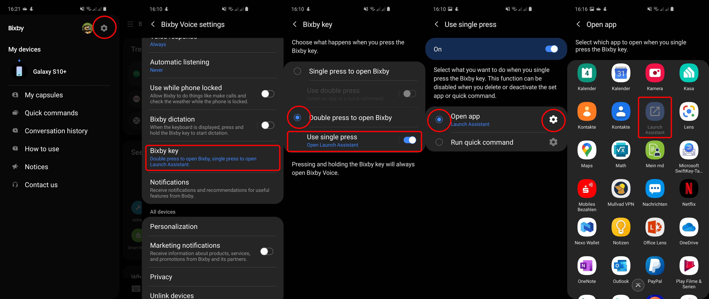

# Launch Assustant

Launch Assistant is a helper app that opens the Google Assistant. This is required if you are using a Samsung phone with a Bixby button. Because Samsung not allows other assistant apps to be opend with this otherwise usless button.

## Usage

1. You need to have the Google Assistant app installed on your device.
2. You need to habe the Launch Assistant app installed on your device.
3. Open your Bixby Settings
    - Click Bixby Key
    - Select Double press to open Bixby
    - Click on Use single press
    - Select on Open app
    - Click on the settings icon
    - Select Launch Assistant
4. Done.

Now a single press of the Bixy button will open the Launch Assistant app. And the Launch Assistant App will instantly launch the Google Assistant.

